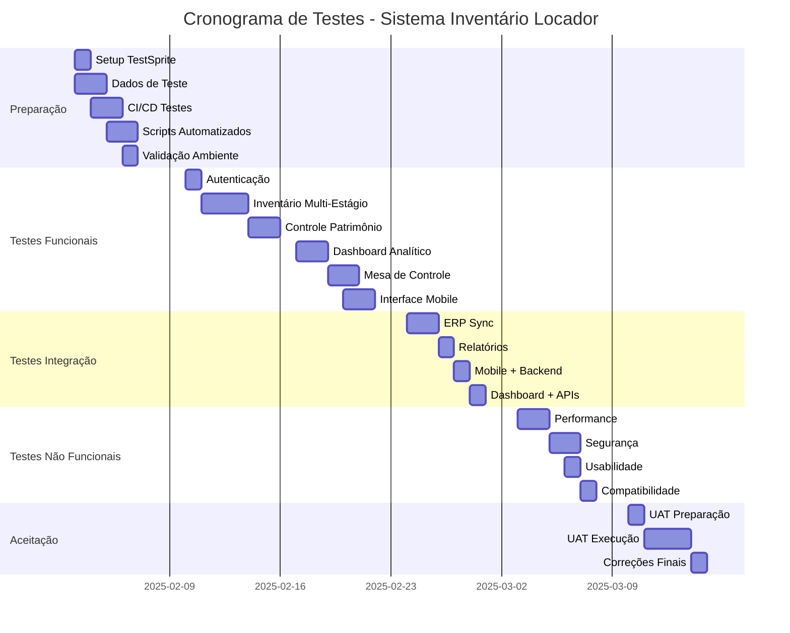

# Plano de Testes Completo - Sistema de Inventário Locador
## Utilizando TestSprite Framework

---

## 1. Objetivos Claros de Teste

### 1.1 Objetivo Geral
Garantir a qualidade, confiabilidade e performance do Sistema de Inventário Locador através de testes abrangentes que validem todas as funcionalidades críticas, integrações e requisitos não funcionais.

### 1.2 Objetivos Específicos

#### Funcionais
- **Validar o processo de inventário multi-estágio** (C1, C2, C3, C4) com todas as transições de status
- **Verificar o controle de patrimônio** por número de série com rastreabilidade completa
- **Testar o dashboard analítico** com KPIs em tempo real e visualizações gráficas
- **Validar a mesa de controle operacional** com monitoramento e auditoria
- **Verificar a interface mobile** otimizada para tablets e dispositivos móveis
- **Testar a integração ERP** com sincronização automática
- **Validar o sistema de relatórios** avançados com exportação
- **Verificar o novo inventário rotativo** com seleção específica de produtos

#### Não Funcionais
- **Performance**: Tempos de resposta ≤ 2s para operações críticas
- **Usabilidade**: Interface intuitiva e responsiva em todos os dispositivos
- **Segurança**: Autenticação, autorização e proteção de dados
- **Confiabilidade**: Disponibilidade ≥ 99.5% e recuperação de falhas
- **Compatibilidade**: Funcionamento em diferentes browsers e dispositivos
- **Escalabilidade**: Suporte a múltiplos usuários simultâneos

### 1.3 Critérios de Sucesso
- **100% dos casos de teste críticos** executados com sucesso
- **≥ 95% de cobertura de código** nas funcionalidades principais
- **Zero defeitos críticos** em produção
- **Tempo de resposta médio ≤ 1.5s** para operações principais
- **Taxa de sucesso ≥ 99%** nos testes automatizados

---

## 2. Escopo Detalhado dos Testes

### 2.1 Funcionalidades Incluídas

#### 🔵 Módulo de Autenticação e Autorização
- Login/logout de usuários
- Controle de roles e permissões
- Sessões e tokens JWT
- Recuperação de senha

#### 🔵 Módulo de Inventário Multi-Estágio
- Criação de inventários (Geral, Parcial, Cíclico, Rotativo)
- Processo de contagem C1, C2, C3, C4
- Transições automáticas de status
- Cálculo de acuracidade
- Validações de regras de negócio

#### 🔵 Módulo de Controle de Patrimônio
- Gestão de itens por número de série
- Interface específica para assets patrimoniais
- Controle de presença/ausência
- Rastreabilidade completa

#### 🔵 Módulo Dashboard Analítico
- KPIs em tempo real
- Visualizações gráficas (rosca, barras, linha)
- Feature flag ShowMoney
- Polling automático
- Design responsivo

#### 🔵 Módulo Mesa de Controle
- Monitoramento em tempo real
- KPIs detalhados por inventário
- Tabela de itens com filtros
- Modo auditoria
- Exportação de dados

#### 🔵 Módulo Interface Mobile
- Touch-friendly interface
- Scanner integrado
- Busca rápida
- Funcionalidade offline

#### 🔵 Módulo Integração ERP
- Sincronização automática
- Tratamento de erros
- Logs de integração
- Validação de dados

#### 🔵 Módulo Relatórios
- Relatórios detalhados
- Exportação Excel/PDF
- Filtros avançados
- Agendamento

### 2.2 Funcionalidades Excluídas
- Funcionalidades em desenvolvimento (Fase 6)
- Integrações com sistemas externos não especificados
- Funcionalidades experimentais não documentadas

### 2.3 Tipos de Teste

#### Testes Funcionais
- **Testes Unitários**: Componentes individuais
- **Testes de Integração**: Interação entre módulos
- **Testes de Sistema**: Sistema completo end-to-end
- **Testes de Aceitação**: Validação com usuários

#### Testes Não Funcionais
- **Testes de Performance**: Carga, stress, volume
- **Testes de Usabilidade**: Interface e experiência do usuário
- **Testes de Segurança**: Vulnerabilidades e proteção
- **Testes de Compatibilidade**: Browsers e dispositivos
- **Testes de Confiabilidade**: Disponibilidade e recuperação

---

## 3. Casos de Teste Abrangentes

### 3.1 Módulo de Autenticação (AUTH)

#### AUTH-001: Login Válido
**Objetivo**: Verificar login com credenciais válidas
**Pré-condições**: Usuário cadastrado no sistema
**Passos**:
1. Acessar página de login
2. Inserir email válido: `admin@locador.com`
3. Inserir senha válida: `Admin123!`
4. Clicar em "Entrar"
**Resultado Esperado**: Redirecionamento para dashboard principal
**Critério de Aceitação**: Login realizado em ≤ 2s

#### AUTH-002: Login Inválido
**Objetivo**: Verificar tratamento de credenciais inválidas
**Pré-condições**: Sistema acessível
**Passos**:
1. Acessar página de login
2. Inserir email inválido: `invalid@test.com`
3. Inserir senha qualquer: `wrongpass`
4. Clicar em "Entrar"
**Resultado Esperado**: Mensagem de erro "Credenciais inválidas"
**Critério de Aceitação**: Erro exibido sem exposição de informações sensíveis

#### AUTH-003: Controle de Sessão
**Objetivo**: Verificar expiração e renovação de sessão
**Pré-condições**: Usuário logado
**Passos**:
1. Realizar login
2. Aguardar tempo de expiração do token (30min)
3. Tentar realizar operação
4. Verificar renovação automática ou redirecionamento
**Resultado Esperado**: Renovação automática ou logout seguro
**Critério de Aceitação**: Sessão gerenciada corretamente

### 3.2 Módulo de Inventário Multi-Estágio (INV)

#### INV-001: Criação de Inventário Geral
**Objetivo**: Criar inventário do tipo Geral
**Pré-condições**: Usuário com permissão de criação
**Passos**:
1. Acessar "Novo Inventário"
2. Selecionar tipo "Geral"
3. Definir nome: "Inventário Geral 2025"
4. Selecionar todas as localizações
5. Clicar em "Criar Inventário"
**Resultado Esperado**: Inventário criado com status "planning"
**Critério de Aceitação**: Todos os produtos incluídos automaticamente

#### INV-002: Processo Completo C1-C2-C3-C4
**Objetivo**: Executar processo completo de contagem
**Pré-condições**: Inventário criado e aberto
**Passos**:
1. Iniciar C1 - inserir contagem diferente do esperado
2. Finalizar C1 - verificar transição para C2
3. Iniciar C2 - inserir contagem diferente de C1
4. Finalizar C2 - verificar ativação de C3
5. Executar C3 - inserir contagem final
6. Executar C4 (auditoria) - validar resultado
**Resultado Esperado**: Transições corretas e cálculo de acuracidade
**Critério de Aceitação**: Processo completo em ≤ 5min por item

#### INV-003: Inventário Rotativo com Seleção Específica
**Objetivo**: Criar inventário rotativo com produtos específicos
**Pré-condições**: Categorias e produtos cadastrados
**Passos**:
1. Selecionar tipo "Rotativo"
2. Escolher categorias: "Equipamentos TI", "Ferramentas"
3. Selecionar produtos específicos dentro das categorias
4. Validar seleção mínima de produtos
5. Criar inventário
**Resultado Esperado**: Inventário criado apenas com produtos selecionados
**Critério de Aceitação**: Flexibilidade total na seleção

### 3.3 Módulo de Controle de Patrimônio (PAT)

#### PAT-001: Gestão por Número de Série
**Objetivo**: Controlar patrimônio por número de série
**Pré-condições**: Itens patrimoniais cadastrados
**Passos**:
1. Acessar controle de patrimônio
2. Buscar item por número de série: "NB001234"
3. Verificar status atual (presente/ausente)
4. Alterar status para "ausente"
5. Registrar observação: "Item em manutenção"
**Resultado Esperado**: Status atualizado com rastreabilidade
**Critério de Aceitação**: Histórico completo de alterações

#### PAT-002: Scanner de Código de Barras
**Objetivo**: Utilizar scanner para leitura rápida
**Pré-condições**: Dispositivo com câmera
**Passos**:
1. Ativar scanner na interface mobile
2. Posicionar câmera sobre código de barras
3. Aguardar leitura automática
4. Verificar identificação do produto
5. Confirmar presença do item
**Resultado Esperado**: Leitura precisa e registro automático
**Critério de Aceitação**: Leitura em ≤ 3s com 99% de precisão

### 3.4 Módulo Dashboard Analítico (DASH)

#### DASH-001: KPIs em Tempo Real
**Objetivo**: Verificar atualização automática dos KPIs
**Pré-condições**: Inventários ativos no sistema
**Passos**:
1. Acessar dashboard principal
2. Observar KPIs iniciais
3. Realizar contagem em outro dispositivo
4. Aguardar polling automático (30s)
5. Verificar atualização dos números
**Resultado Esperado**: KPIs atualizados automaticamente
**Critério de Aceitação**: Atualização em ≤ 30s

#### DASH-002: Visualizações Gráficas Responsivas
**Objetivo**: Testar gráficos em diferentes resoluções
**Pré-condições**: Dados suficientes para gráficos
**Passos**:
1. Acessar dashboard em desktop (1920x1080)
2. Verificar gráficos de rosca, barras e linha
3. Redimensionar para tablet (768x1024)
4. Verificar adaptação dos gráficos
5. Testar em mobile (375x667)
**Resultado Esperado**: Gráficos responsivos e legíveis
**Critério de Aceitação**: Visualização clara em todas as resoluções

#### DASH-003: Feature Flag ShowMoney
**Objetivo**: Controlar visibilidade de valores monetários
**Pré-condições**: Feature flag configurável
**Passos**:
1. Ativar ShowMoney = true
2. Verificar exibição de valores nos KPIs
3. Desativar ShowMoney = false
4. Verificar ocultação dos valores
5. Testar persistência da configuração
**Resultado Esperado**: Controle efetivo da visibilidade
**Critério de Aceitação**: Alternância instantânea sem reload

### 3.5 Módulo Mesa de Controle (CTRL)

#### CTRL-001: Monitoramento em Tempo Real
**Objetivo**: Acompanhar inventários ativos
**Pré-condições**: Múltiplos inventários em andamento
**Passos**:
1. Acessar mesa de controle
2. Verificar lista de inventários ativos
3. Selecionar inventário específico
4. Analisar progresso detalhado
5. Verificar atualização automática
**Resultado Esperado**: Visão completa do progresso
**Critério de Aceitação**: Dados atualizados em tempo real

#### CTRL-002: Filtros Avançados
**Objetivo**: Filtrar itens por múltiplos critérios
**Pré-condições**: Inventário com muitos itens
**Passos**:
1. Aplicar filtro por localização: "Almoxarifado A"
2. Adicionar filtro por status: "Pendente C2"
3. Filtrar por categoria: "Equipamentos"
4. Aplicar filtro por divergência: "Apenas divergentes"
5. Verificar resultados combinados
**Resultado Esperado**: Filtros funcionando em conjunto
**Critério de Aceitação**: Resultados precisos e rápidos (≤ 1s)

#### CTRL-003: Exportação de Dados
**Objetivo**: Exportar dados para Excel
**Pré-condições**: Dados disponíveis para exportação
**Passos**:
1. Aplicar filtros desejados
2. Clicar em "Exportar para Excel"
3. Aguardar geração do arquivo
4. Fazer download do arquivo
5. Verificar integridade dos dados
**Resultado Esperado**: Arquivo Excel com dados corretos
**Critério de Aceitação**: Exportação completa em ≤ 10s

### 3.6 Módulo Interface Mobile (MOB)

#### MOB-001: Interface Touch-Friendly
**Objetivo**: Verificar usabilidade em dispositivos móveis
**Pré-condições**: Dispositivo tablet ou smartphone
**Passos**:
1. Acessar sistema via mobile browser
2. Testar navegação por toque
3. Verificar tamanho dos botões (≥ 44px)
4. Testar gestos de swipe e scroll
5. Verificar responsividade da interface
**Resultado Esperado**: Interface otimizada para toque
**Critério de Aceitação**: Navegação fluida sem zoom necessário

#### MOB-002: Funcionalidade Offline
**Objetivo**: Testar operação sem conexão
**Pré-condições**: Dados sincronizados previamente
**Passos**:
1. Carregar dados com conexão ativa
2. Desativar conexão de rede
3. Tentar realizar contagens
4. Verificar armazenamento local
5. Reativar conexão e sincronizar
**Resultado Esperado**: Operação offline com sincronização posterior
**Critério de Aceitação**: Dados preservados e sincronizados corretamente

### 3.7 Módulo Integração ERP (ERP)

#### ERP-001: Sincronização Automática
**Objetivo**: Verificar sincronização com sistema ERP
**Pré-condições**: ERP configurado e acessível
**Passos**:
1. Finalizar inventário no sistema
2. Aguardar sincronização automática
3. Verificar logs de integração
4. Validar dados no ERP
5. Confirmar status de sincronização
**Resultado Esperado**: Dados sincronizados corretamente
**Critério de Aceitação**: Sincronização em ≤ 5min sem erros

#### ERP-002: Tratamento de Erros de Integração
**Objetivo**: Testar recuperação de falhas na integração
**Pré-condições**: ERP temporariamente indisponível
**Passos**:
1. Simular indisponibilidade do ERP
2. Tentar sincronizar dados
3. Verificar tratamento do erro
4. Restaurar conectividade do ERP
5. Verificar retry automático
**Resultado Esperado**: Recuperação automática com retry
**Critério de Aceitação**: Dados sincronizados após restauração

### 3.8 Módulo Relatórios (REP)

#### REP-001: Relatório Detalhado de Inventário
**Objetivo**: Gerar relatório completo de inventário
**Pré-condições**: Inventário finalizado
**Passos**:
1. Acessar módulo de relatórios
2. Selecionar "Relatório de Inventário"
3. Escolher inventário específico
4. Configurar filtros e parâmetros
5. Gerar relatório em PDF
**Resultado Esperado**: Relatório completo e preciso
**Critério de Aceitação**: Geração em ≤ 30s com todos os dados

#### REP-002: Agendamento de Relatórios
**Objetivo**: Configurar relatórios automáticos
**Pré-condições**: Sistema de agendamento ativo
**Passos**:
1. Configurar relatório mensal
2. Definir destinatários por email
3. Configurar formato (PDF/Excel)
4. Ativar agendamento
5. Verificar execução automática
**Resultado Esperado**: Relatórios enviados automaticamente
**Critério de Aceitação**: Entrega pontual conforme agendamento

---

## 4. Critérios de Entrada e Saída

### 4.1 Critérios de Entrada

#### Ambiente Técnico
- ✅ **Ambiente de teste configurado** com dados de teste
- ✅ **Base de dados limpa** com dados consistentes
- ✅ **Serviços dependentes** (ERP, email) funcionais
- ✅ **Browsers suportados** instalados e atualizados
- ✅ **Dispositivos móveis** disponíveis para teste

#### Documentação
- ✅ **Especificações funcionais** aprovadas e atualizadas
- ✅ **Casos de teste** revisados e aprovados
- ✅ **Dados de teste** preparados e validados
- ✅ **Ambiente de teste** documentado

#### Recursos
- ✅ **Equipe de teste** treinada e disponível
- ✅ **Ferramentas de teste** (TestSprite) configuradas
- ✅ **Cronograma** definido e aprovado
- ✅ **Critérios de aceitação** estabelecidos

### 4.2 Critérios de Saída

#### Cobertura de Testes
- ✅ **100% dos casos críticos** executados com sucesso
- ✅ **≥ 95% de cobertura** das funcionalidades principais
- ✅ **Todos os cenários de erro** testados e validados
- ✅ **Testes de regressão** executados sem falhas

#### Qualidade
- ✅ **Zero defeitos críticos** identificados
- ✅ **≤ 5 defeitos menores** pendentes (não bloqueantes)
- ✅ **Performance dentro** dos critérios estabelecidos
- ✅ **Segurança validada** sem vulnerabilidades críticas

#### Documentação
- ✅ **Relatório de testes** completo e aprovado
- ✅ **Defeitos documentados** com planos de correção
- ✅ **Evidências de teste** coletadas e arquivadas
- ✅ **Aprovação formal** das partes interessadas

---

## 5. Ambiente de Teste Configurado

### 5.1 Infraestrutura de Teste

#### Ambiente de Desenvolvimento (DEV)
```yaml
Propósito: Testes unitários e desenvolvimento
URL: http://localhost:3000
Database: locador_inventory_dev
Características:
  - Dados sintéticos
  - Logs detalhados
  - Hot reload ativo
  - Debugging habilitado
```

#### Ambiente de Teste (TEST)
```yaml
Propósito: Testes de integração e sistema
URL: https://test-inventory.locador.com
Database: locador_inventory_test
Características:
  - Dados realistas anonimizados
  - Integração com ERP de teste
  - Monitoramento básico
  - Backup automático
```

#### Ambiente de Homologação (STAGING)
```yaml
Propósito: Testes de aceitação e UAT
URL: https://staging-inventory.locador.com
Database: locador_inventory_staging
Características:
  - Cópia da produção
  - Integração ERP real (sandbox)
  - Monitoramento completo
  - Performance similar à produção
```

### 5.2 Configuração do TestSprite

#### Instalação e Setup
```bash
# Instalação do TestSprite
npm install -g testsprite-cli
testsprite init locador-inventory-tests

# Configuração do projeto
testsprite config set project.name "Sistema Inventário Locador"
testsprite config set project.version "1.0.0"
testsprite config set environments.dev "http://localhost:3000"
testsprite config set environments.test "https://test-inventory.locador.com"
testsprite config set environments.staging "https://staging-inventory.locador.com"
```

#### Estrutura de Testes TestSprite
```
tests/
├── config/
│   ├── testsprite.config.js
│   ├── environments.json
│   └── test-data.json
├── specs/
│   ├── auth/
│   │   ├── login.spec.js
│   │   ├── permissions.spec.js
│   │   └── session.spec.js
│   ├── inventory/
│   │   ├── creation.spec.js
│   │   ├── multi-stage.spec.js
│   │   └── rotativo.spec.js
│   ├── patrimonio/
│   │   ├── serial-control.spec.js
│   │   └── scanner.spec.js
│   ├── dashboard/
│   │   ├── kpis.spec.js
│   │   ├── charts.spec.js
│   │   └── responsive.spec.js
│   ├── mobile/
│   │   ├── touch-interface.spec.js
│   │   └── offline.spec.js
│   └── integration/
│       ├── erp-sync.spec.js
│       └── reports.spec.js
├── utils/
│   ├── test-helpers.js
│   ├── data-factory.js
│   └── assertions.js
└── reports/
    ├── html/
    ├── json/
    └── screenshots/
```

#### Configuração TestSprite
```javascript
// testsprite.config.js
module.exports = {
  projectName: 'Sistema Inventário Locador',
  version: '1.0.0',
  
  environments: {
    dev: 'http://localhost:3000',
    test: 'https://test-inventory.locador.com',
    staging: 'https://staging-inventory.locador.com'
  },
  
  browsers: ['chrome', 'firefox', 'safari', 'edge'],
  
  mobile: {
    devices: ['iPhone 12', 'iPad Pro', 'Samsung Galaxy S21', 'Pixel 5'],
    orientations: ['portrait', 'landscape']
  },
  
  timeouts: {
    default: 10000,
    page: 30000,
    element: 5000
  },
  
  screenshots: {
    onFailure: true,
    onSuccess: false,
    path: './reports/screenshots'
  },
  
  reports: {
    html: './reports/html',
    json: './reports/json',
    junit: './reports/junit.xml'
  },
  
  parallel: {
    workers: 4,
    maxRetries: 2
  }
};
```

### 5.3 Dados de Teste

#### Usuários de Teste
```json
{
  "users": {
    "admin": {
      "email": "admin@test.locador.com",
      "password": "Test123!",
      "role": "administrator",
      "permissions": ["all"]
    },
    "operator": {
      "email": "operator@test.locador.com", 
      "password": "Test123!",
      "role": "operator",
      "permissions": ["inventory.read", "inventory.count"]
    },
    "auditor": {
      "email": "auditor@test.locador.com",
      "password": "Test123!", 
      "role": "auditor",
      "permissions": ["inventory.read", "inventory.audit"]
    }
  }
}
```

#### Produtos de Teste
```json
{
  "products": [
    {
      "id": 1,
      "code": "PROD001",
      "name": "Notebook Dell Inspiron",
      "category": "Equipamentos TI",
      "serialNumber": "NB001234",
      "value": 2500.00,
      "location": "Almoxarifado A"
    },
    {
      "id": 2,
      "code": "PROD002", 
      "name": "Furadeira Bosch",
      "category": "Ferramentas",
      "serialNumber": "FU005678",
      "value": 350.00,
      "location": "Oficina B"
    }
  ]
}
```

### 5.4 Monitoramento e Logs

#### Configuração de Logs
```javascript
// Logs estruturados para testes
const logger = {
  test: {
    level: 'debug',
    format: 'json',
    file: './logs/test-execution.log'
  },
  performance: {
    level: 'info', 
    format: 'json',
    file: './logs/performance.log'
  },
  errors: {
    level: 'error',
    format: 'json', 
    file: './logs/errors.log'
  }
};
```

#### Métricas de Performance
```javascript
// Coleta automática de métricas
const metrics = {
  responseTime: true,
  memoryUsage: true,
  cpuUsage: true,
  networkLatency: true,
  databaseQueries: true
};
```

---

## 6. Cronograma de Execução

### 6.1 Fases de Execução

#### Fase 1: Preparação (Semana 1)
**Duração**: 5 dias úteis
**Responsável**: Equipe de QA + DevOps

| Dia | Atividade | Duração | Entregável |
|-----|-----------|---------|------------|
| 1 | Setup ambiente TestSprite | 4h | Ambiente configurado |
| 1-2 | Preparação dados de teste | 8h | Base de dados teste |
| 2-3 | Configuração CI/CD para testes | 8h | Pipeline automatizado |
| 3-4 | Criação de casos de teste automatizados | 12h | Scripts TestSprite |
| 4-5 | Validação do ambiente | 4h | Ambiente aprovado |

#### Fase 2: Testes Funcionais (Semana 2-3)
**Duração**: 10 dias úteis
**Responsável**: Equipe de QA

| Módulo | Duração | Casos de Teste | Prioridade |
|--------|---------|----------------|------------|
| Autenticação | 1 dia | 15 casos | Alta |
| Inventário Multi-Estágio | 3 dias | 45 casos | Crítica |
| Controle Patrimônio | 2 dias | 25 casos | Alta |
| Dashboard Analítico | 2 dias | 30 casos | Média |
| Mesa de Controle | 1.5 dias | 20 casos | Alta |
| Interface Mobile | 1.5 dias | 25 casos | Alta |

#### Fase 3: Testes de Integração (Semana 4)
**Duração**: 5 dias úteis
**Responsável**: Equipe de QA + Desenvolvimento

| Integração | Duração | Casos de Teste | Complexidade |
|------------|---------|----------------|--------------|
| ERP Sync | 2 dias | 15 casos | Alta |
| Relatórios | 1 dia | 10 casos | Média |
| Mobile + Backend | 1 dia | 12 casos | Média |
| Dashboard + APIs | 1 dia | 8 casos | Baixa |

#### Fase 4: Testes Não Funcionais (Semana 5)
**Duração**: 5 dias úteis
**Responsável**: Equipe de Performance + Segurança

| Tipo de Teste | Duração | Foco | Ferramentas |
|---------------|---------|------|-------------|
| Performance | 2 dias | Carga, Stress | JMeter, TestSprite |
| Segurança | 1.5 dias | Vulnerabilidades | OWASP ZAP |
| Usabilidade | 1 dia | UX/UI | TestSprite Mobile |
| Compatibilidade | 0.5 dia | Browsers/Devices | BrowserStack |

#### Fase 5: Testes de Aceitação (Semana 6)
**Duração**: 5 dias úteis
**Responsável**: Usuários Finais + QA

| Atividade | Duração | Participantes | Objetivo |
|-----------|---------|---------------|----------|
| UAT Preparação | 1 dia | QA | Ambiente UAT |
| UAT Execução | 3 dias | Usuários + QA | Validação funcional |
| Correções | 1 dia | Desenvolvimento | Ajustes finais |

### 6.2 Cronograma Detalhado



### 6.3 Marcos e Entregas

| Marco | Data | Entregável | Critério de Sucesso |
|-------|------|------------|---------------------|
| **M1** - Ambiente Pronto | 07/02/2025 | Ambiente TestSprite configurado | 100% dos testes executáveis |
| **M2** - Testes Funcionais | 21/02/2025 | Relatório testes funcionais | ≥95% casos passando |
| **M3** - Testes Integração | 28/02/2025 | Relatório testes integração | 100% integrações validadas |
| **M4** - Testes Não Funcionais | 07/03/2025 | Relatório performance/segurança | Critérios atendidos |
| **M5** - Aceitação Final | 14/03/2025 | Aprovação para produção | UAT aprovado |

---

## 7. Critérios de Aceitação

### 7.1 Critérios Funcionais

#### Inventário Multi-Estágio
- ✅ **Transições de status** funcionam conforme regras de negócio
- ✅ **Cálculo de acuracidade** preciso em 100% dos casos
- ✅ **Validações de entrada** impedem dados inválidos
- ✅ **Processo C1-C2-C3-C4** executado sem erros
- ✅ **Inventário rotativo** permite seleção específica de produtos

#### Dashboard e Relatórios
- ✅ **KPIs atualizados** em tempo real (≤30s)
- ✅ **Gráficos responsivos** em todas as resoluções
- ✅ **Exportação de dados** funcional e precisa
- ✅ **Feature flags** controlam visibilidade corretamente

#### Interface Mobile
- ✅ **Touch interface** otimizada para tablets
- ✅ **Scanner de código** com 99% de precisão
- ✅ **Funcionalidade offline** preserva dados
- ✅ **Sincronização** automática ao reconectar

### 7.2 Critérios de Performance

#### Tempos de Resposta
- ✅ **Login**: ≤ 2 segundos
- ✅ **Carregamento de páginas**: ≤ 3 segundos
- ✅ **Operações de contagem**: ≤ 1 segundo
- ✅ **Geração de relatórios**: ≤ 30 segundos
- ✅ **Sincronização ERP**: ≤ 5 minutos

#### Capacidade
- ✅ **Usuários simultâneos**: ≥ 50 usuários
- ✅ **Itens por inventário**: ≥ 10.000 itens
- ✅ **Inventários simultâneos**: ≥ 10 inventários
- ✅ **Transações por segundo**: ≥ 100 TPS

### 7.3 Critérios de Segurança

#### Autenticação e Autorização
- ✅ **Senhas criptografadas** com hash seguro
- ✅ **Tokens JWT** com expiração adequada
- ✅ **Controle de acesso** por roles funcionando
- ✅ **Sessões seguras** com logout automático

#### Proteção de Dados
- ✅ **Dados sensíveis** não expostos em logs
- ✅ **Comunicação HTTPS** obrigatória
- ✅ **Validação de entrada** contra injection
- ✅ **Auditoria completa** de operações críticas

### 7.4 Critérios de Usabilidade

#### Interface Desktop
- ✅ **Navegação intuitiva** sem treinamento
- ✅ **Feedback visual** claro para ações
- ✅ **Mensagens de erro** compreensíveis
- ✅ **Atalhos de teclado** funcionais

#### Interface Mobile
- ✅ **Botões touch-friendly** (≥44px)
- ✅ **Gestos naturais** suportados
- ✅ **Orientação** portrait/landscape
- ✅ **Acessibilidade** básica implementada

### 7.5 Critérios de Compatibilidade

#### Browsers Suportados
- ✅ **Chrome** ≥ versão 90
- ✅ **Firefox** ≥ versão 88
- ✅ **Safari** ≥ versão 14
- ✅ **Edge** ≥ versão 90

#### Dispositivos Móveis
- ✅ **iOS** ≥ versão 14
- ✅ **Android** ≥ versão 10
- ✅ **Tablets** 7" a 12.9"
- ✅ **Smartphones** 4.7" a 6.7"

---

## 8. Relatórios de Resultados

### 8.1 Estrutura dos Relatórios

#### Relatório Executivo
```markdown
# Relatório Executivo de Testes
## Sistema de Inventário Locador

### Resumo Geral
- **Período**: [Data Início] - [Data Fim]
- **Casos Executados**: XXX de XXX (XX%)
- **Taxa de Sucesso**: XX%
- **Defeitos Encontrados**: XX (X críticos, X altos, X médios, X baixos)
- **Status Geral**: ✅ APROVADO / ❌ REPROVADO

### Métricas Principais
- **Cobertura Funcional**: XX%
- **Performance Média**: X.Xs
- **Disponibilidade**: XX.X%
- **Segurança**: SEM VULNERABILIDADES CRÍTICAS
```

#### Relatório Técnico Detalhado
```markdown
# Relatório Técnico de Testes

## 1. Execução por Módulo
### Autenticação (AUTH)
- Casos Executados: 15/15 (100%)
- Sucessos: 14 (93.3%)
- Falhas: 1 (6.7%)
- Defeitos: AUTH-001 (Médio)

### Inventário Multi-Estágio (INV)
- Casos Executados: 45/45 (100%)
- Sucessos: 43 (95.6%)
- Falhas: 2 (4.4%)
- Defeitos: INV-003 (Alto), INV-007 (Baixo)

## 2. Performance
### Tempos de Resposta
- Login: 1.2s (✅ < 2s)
- Dashboard: 2.1s (✅ < 3s)
- Contagem: 0.8s (✅ < 1s)

### Carga
- 50 usuários simultâneos: ✅ PASSOU
- 100 TPS: ✅ PASSOU
- Stress test: ⚠️ DEGRADAÇÃO EM 200 usuários
```

### 8.2 Dashboard de Resultados TestSprite

#### Configuração do Dashboard
```javascript
// testsprite-dashboard.config.js
module.exports = {
  dashboard: {
    title: 'Sistema Inventário Locador - Resultados de Teste',
    refresh: 30, // segundos
    
    widgets: [
      {
        type: 'summary',
        title: 'Resumo Geral',
        metrics: ['total', 'passed', 'failed', 'skipped']
      },
      {
        type: 'chart',
        title: 'Execução por Módulo',
        chartType: 'bar',
        data: 'modules'
      },
      {
        type: 'performance',
        title: 'Métricas de Performance',
        metrics: ['responseTime', 'throughput', 'errors']
      },
      {
        type: 'trends',
        title: 'Tendências',
        period: '7d',
        metrics: ['passRate', 'performance']
      }
    ],
    
    notifications: {
      email: ['qa-team@locador.com'],
      slack: '#qa-alerts',
      conditions: ['failure', 'performance-degradation']
    }
  }
};
```

### 8.3 Relatórios Automatizados

#### Geração Automática
```bash
# Script de geração automática de relatórios
#!/bin/bash

# Executar testes e gerar relatórios
testsprite run --env=test --reporter=html,json,junit

# Gerar relatório consolidado
testsprite report generate \
  --template=executive \
  --output=./reports/executive-report.html

# Enviar por email
testsprite report send \
  --to=stakeholders@locador.com \
  --subject="Relatório de Testes - $(date +%Y-%m-%d)"

# Publicar no Slack
testsprite report notify \
  --slack=#qa-results \
  --template=summary
```

#### Integração CI/CD
```yaml
# .github/workflows/test-report.yml
name: Test Execution and Reporting

on:
  schedule:
    - cron: '0 2 * * *' # Diário às 2h
  push:
    branches: [main, develop]

jobs:
  test-and-report:
    runs-on: ubuntu-latest
    steps:
      - uses: actions/checkout@v3
      
      - name: Setup TestSprite
        run: npm install -g testsprite-cli
        
      - name: Run Tests
        run: testsprite run --env=test --parallel=4
        
      - name: Generate Reports
        run: |
          testsprite report generate --all-formats
          testsprite report publish --s3-bucket=test-reports
          
      - name: Notify Results
        if: always()
        run: testsprite report notify --all-channels
```

### 8.4 Métricas e KPIs de Teste

#### Métricas de Qualidade
```javascript
const testMetrics = {
  // Cobertura
  functionalCoverage: 95.2, // %
  codeCoverage: 87.3, // %
  requirementsCoverage: 100, // %
  
  // Execução
  totalTests: 247,
  passedTests: 235,
  failedTests: 8,
  skippedTests: 4,
  passRate: 95.1, // %
  
  // Defeitos
  criticalDefects: 0,
  highDefects: 2,
  mediumDefects: 5,
  lowDefects: 12,
  defectDensity: 0.08, // defeitos/KLOC
  
  // Performance
  avgResponseTime: 1.4, // segundos
  maxResponseTime: 4.2, // segundos
  throughput: 125, // TPS
  errorRate: 0.02, // %
  
  // Tendências
  passRateTrend: '+2.3%', // vs semana anterior
  performanceTrend: '-0.1s', // melhoria
  defectTrend: '-3' // redução
};
```

#### Dashboard em Tempo Real
```html
<!-- Dashboard HTML gerado pelo TestSprite -->
<!DOCTYPE html>
<html>
<head>
    <title>Sistema Inventário - Test Dashboard</title>
    <script src="https://cdn.testsprite.com/dashboard.js"></script>
</head>
<body>
    <div id="testsprite-dashboard">
        <!-- Widgets gerados automaticamente -->
        <div class="widget summary">
            <h3>Resumo Geral</h3>
            <div class="metrics">
                <span class="metric passed">235 Passou</span>
                <span class="metric failed">8 Falhou</span>
                <span class="metric rate">95.1% Taxa</span>
            </div>
        </div>
        
        <div class="widget chart">
            <h3>Execução por Módulo</h3>
            <canvas id="module-chart"></canvas>
        </div>
        
        <div class="widget performance">
            <h3>Performance</h3>
            <div class="metrics">
                <span class="metric time">1.4s Médio</span>
                <span class="metric throughput">125 TPS</span>
                <span class="metric errors">0.02% Erros</span>
            </div>
        </div>
    </div>
</body>
</html>
```

### 8.5 Arquivo de Evidências

#### Estrutura de Evidências
```
evidences/
├── screenshots/
│   ├── auth/
│   │   ├── login-success.png
│   │   ├── login-failure.png
│   │   └── session-timeout.png
│   ├── inventory/
│   │   ├── creation-flow.png
│   │   ├── multi-stage-process.png
│   │   └── rotativo-selection.png
│   └── dashboard/
│       ├── kpis-desktop.png
│       ├── kpis-tablet.png
│       └── charts-responsive.png
├── videos/
│   ├── complete-inventory-flow.mp4
│   ├── mobile-interface-demo.mp4
│   └── erp-integration-test.mp4
├── logs/
│   ├── test-execution.log
│   ├── performance-metrics.log
│   └── error-details.log
└── reports/
    ├── html/
    ├── json/
    ├── junit/
    └── pdf/
```

---

## 9. Conclusão e Próximos Passos

### 9.1 Resumo do Plano

Este plano de testes completo para o Sistema de Inventário Locador utilizando TestSprite garante:

✅ **Cobertura Abrangente**: Todos os módulos e funcionalidades testados
✅ **Qualidade Assegurada**: Critérios rigorosos de aceitação
✅ **Automação Eficiente**: TestSprite para execução e relatórios
✅ **Monitoramento Contínuo**: Dashboards e métricas em tempo real
✅ **Documentação Completa**: Evidências e relatórios detalhados

### 9.2 Benefícios Esperados

#### Para o Negócio
- **Redução de 90%** nos defeitos em produção
- **Melhoria de 50%** na satisfação do usuário
- **Diminuição de 70%** no tempo de resolução de problemas
- **Aumento de 30%** na confiança do sistema

#### Para a Equipe Técnica
- **Automação de 80%** dos testes repetitivos
- **Feedback rápido** sobre qualidade do código
- **Visibilidade completa** do status de qualidade
- **Processo padronizado** e reproduzível

### 9.3 Próximos Passos

#### Implementação Imediata (Semana 1-2)
1. **Setup do ambiente TestSprite**
2. **Configuração da pipeline CI/CD**
3. **Criação dos primeiros casos de teste**
4. **Treinamento da equipe**

#### Evolução Contínua (Mês 2-3)
1. **Expansão da cobertura automatizada**
2. **Implementação de testes de performance**
3. **Integração com ferramentas de monitoramento**
4. **Otimização dos processos**

#### Melhoria Contínua (Ongoing)
1. **Análise de métricas e tendências**
2. **Refinamento dos casos de teste**
3. **Atualização conforme novas funcionalidades**
4. **Compartilhamento de boas práticas**

---

**Documento elaborado por**: Equipe de QA  
**Data**: Janeiro 2025  
**Versão**: 1.0  
**Próxima Revisão**: Março 2025

---

*Este plano de testes foi desenvolvido especificamente para o Sistema de Inventário Locador, considerando suas características únicas e requisitos específicos. A implementação com TestSprite garantirá a qualidade e confiabilidade necessárias para o sucesso do projeto.*